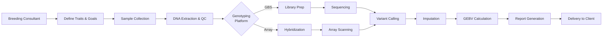

# NLFDP Detailed Services Catalog
**National Livestock and Fisheries Development Program**  
*Comprehensive Genomic Services for Animal Agriculture & Biosecurity*

---

## Table of Contents
1. [Overview](#overview)
2. [Pricing Structure](#pricing-structure)
3. [Sample Submission Guidelines](#sample-submission)
4. [Service Categories](#service-categories)
   - [Livestock Genomics](#livestock-genomics)
   - [Aquaculture Genomics](#aquaculture-genomics)
   - [Pathogen Genomics & One Health](#pathogen-genomics)
   - [Bioinformatics Services](#bioinformatics-services)
5. [Workflows](#workflows)
6. [Support & Contact](#support)

---

## Overview

This catalog provides detailed specifications, pricing, and workflows for all genomic services offered by NLFDP. Our services are designed specifically for:

**Target Species:**
- **Livestock**: Camels, Sheep, Bovine (Cattle), Chicken, Horse, Goats
- **Aquaculture**: Nile Tilapia, Whiteleg Shrimp, Asian Seabass, Gilthead Seabream, Sobaity Seabream
- **Pathogens**: Viral, bacterial, and parasitic agents affecting these species

**Service Tiers:**
- **Standard**: Cost-effective, standard turnaround time
- **Premium**: Priority processing, enhanced support, expedited delivery

---

## Pricing Structure

### General Pricing Terms

| **Volume Tier** | **Samples** | **Discount** |
|----------------|-------------|--------------|
| Individual | 1-10 | Base Price |
| Small Batch | 11-50 | 10% |
| Medium Batch | 51-200 | 15% |
| Large Batch | 201-500 | 20% |
| Enterprise | 501+ | Custom Quote |

**Payment Terms:**
- 50% deposit upon project initiation
- Balance due upon data delivery
- Academic institutions: Net 30 days
- Commercial clients: Net 15 days

**Rush Service:** +50% surcharge for 50% faster turnaround

---

## Sample Submission Guidelines

### General Requirements

| **Sample Type** | **Volume Required** | **Preservation** | **Shipping** |
|----------------|---------------------|------------------|--------------|
| Blood (EDTA) | 3-5 mL | Room temp, <48h | Ambient |
| Tissue | 25-50 mg | -20°C or 95% EtOH | Ice pack |
| Hair (with follicle) | 20-30 strands | Dry, room temp | Ambient |
| Fin Clip | 0.5-1 cm² | 95% EtOH | Ambient |
| Swab (Oral/Nasal) | Saturated swab | Dry or transport medium | Ambient |
| Water Sample | 500 mL - 1 L | Filtered (0.22 μm) | Ice pack |

**Quality Standards:**
- DNA Concentration: ≥20 ng/μL
- 260/280 Ratio: 1.8-2.0
- 260/230 Ratio: 2.0-2.2
- DNA Integrity Number (DIN): ≥7.0 (for WGS)

**Labeling:** Unique ID, Species, Sample Type, Collection Date

---

## Service Categories

## 1. Livestock Genomics

*Accelerating genetic improvement for superior breeding outcomes*

### 1.1 Genomic Selection & GEBV Estimation

**Service Code:** LG-GS-001

**Description:**  
Comprehensive genotyping service combined with advanced genomic prediction models to calculate Genomic Estimated Breeding Values (GEBVs) for selection candidates.

**Target Species:** Camels, Sheep, Bovine, Chicken, Goats, Horses

**Technical Specifications:**

| **Tier** | **Platform** | **SNP Density** | **Imputation** | **Price (SAR)** |
|----------|-------------|-----------------|----------------|-----------------|
| Standard | GBS (ddRAD) | 10K-30K | To HD array | 450/sample |
| Premium | HD SNP Array | 50K-777K | - | 850/sample |
| Custom | WGS (10x) | Genome-wide | - | 2,500/sample |

**Analysis Included:**
- Quality control & genotype calling
- Imputation to reference panel (if applicable)
- GEBV calculation for up to 5 traits
- Genomic relationship matrix
- Inbreeding coefficients (F)

**Additional Requirements:**
- **Phenotype Data**: Trait records for training population (min. 500 animals)
- **Pedigree**: Family structure information (recommended)
- **Reference Population**: Breed-specific panel (first-time clients: +15,000 SAR setup fee)

**Deliverables:**
- Genotype call file (VCF format)
- GEBV report per animal (PDF)
- Selection ranking list (CSV)
- Genomic relationship heatmap (PNG)
- Technical report with accuracy metrics

**Turnaround Time:**
- Standard: 5-6 weeks
- Premium: 3-4 weeks
- Rush: 2-3 weeks (+50%)

**Process Workflow:**

---

### 1.2 Parentage Verification & Pedigree Validation

**Service Code:** LG-PV-002

**Description:**  
DNA-based confirmation of parent-offspring relationships using microsatellite (STR) markers or SNP panels to ensure pedigree accuracy for breeding programs and registry certification.

**Target Species:** All Livestock (specialized panels for Camels, Horses)

**Technical Specifications:**

| **Tier** | **Markers** | **Exclusion Power** | **Price (SAR)** |
|----------|------------|---------------------|-----------------|
| Standard | 12-17 STRs | >99.9% | 280/trio |
| Premium | 50-200 SNPs | >99.99% | 450/trio |

*Trio = 1 offspring + 2 parents*

**Analysis Included:**
- DNA extraction & amplification
- Marker genotyping
- Parent-assignment likelihood calculation
- Pedigree error detection
- Certification letter (if applicable)

**Deliverables:**
- Parentage verification certificate (PDF)
- Genotype table (Excel)
- Exclusion probability report
- Pedigree validation summary

**Turnaround Time:**
- Standard: 2-3 weeks
- Rush: 7-10 days (+50%)

---

### 1.3 Breed Characterization & Genomic Diversity Analysis

**Service Code:** LG-BC-003

**Description:**  
Population-scale genomic analysis to assess genetic diversity, admixture, and unique adaptive signatures in native or commercial breeds.

**Target Species:** Native breeds of Camels, Sheep, Goats

**Technical Specifications:**

| **Tier** | **Technology** | **Coverage** | **Min. Samples** | **Price (SAR)** |
|----------|---------------|--------------|------------------|-----------------|
| Standard | SNP Array (50K) | - | 30 | 650/sample |
| Premium | WGS (15x) | Medium | 20 | 3,200/sample |
| Deep | WGS (30x) | High | 10 | 5,500/sample |

**Analysis Included:**
- Population structure (PCA, ADMIXTURE)
- Genetic diversity metrics (He, Ho, Ne)
- Runs of Homozygosity (ROH) & inbreeding (FROH)
- FST pairwise comparisons
- Selection signatures (iHS, XP-EHH)
- Phylogenetic tree construction

**Deliverables:**
- Comprehensive population report (PDF, 30-50 pages)
- PCA plots & ADMIXTURE bar plots
- Diversity statistics table (CSV)
- ROH distribution plots
- Interactive genomic browser (optional, +2,000 SAR)

**Turnaround Time:**
- Standard: 8-10 weeks  
- Premium: 6-8 weeks

---

### 1.4 Trait Association & Genomic Prediction (Custom)

**Service Code:** LG-TA-004

**Description:**  
Genome-Wide Association Study (GWAS) to identify genomic regions associated with traits of interest, followed by development of custom genomic prediction models.

**Target Species:** Any livestock species with sufficient reference data

**Technical Specifications:**
- **Platform**: WGS (≥10x) or High-Density SNP Array
- **Minimum Sample Size**: 
  - Discovery cohort: 300+ animals
  - Validation cohort: 100+ animals
- **Phenotype**: Quantitative or binary traits

**Price:** Custom quote based on scope (typically 50,000 - 150,000 SAR per trait)

**Analysis Included:**
- GWAS (single-SNP and haplotype-based)
- LD decay analysis
- Candidate gene identification
- Functional annotation
- Genomic prediction model calibration  
- Cross-validation accuracy

**Deliverables:**
- GWAS report with Manhattan/QQ plots
- Significant SNP table with annotations
- Genomic prediction equation
- Model accuracy metrics

**Turnaround Time:** 10-14 weeks

---

## 2. Aquaculture Genomics

*Optimizing production, health, and sustainability in aquatic farming*

### 2.1 Broodstock Management & Family Selection

**Service Code:** AQ-BM-001

**Description:**  
Genetic profiling of broodstock to minimize inbreeding, reconstruct family pedigrees, and select superior families for grow-out production.

**Target Species:** Nile Tilapia, Whiteleg Shrimp, Asian Seabass, Seabream (Gilthead, Sobaity)

**Technical Specifications:**

| **Tier** | **Markers** | **Analysis** | **Price (SAR)** |
|----------|------------|--------------|-----------------|
| Standard | 100-500 SNPs | Pedigree + F | 350/sample |
| Premium | 5K-15K SNPs | Pedigree + F + GEBV | 550/sample |

**Analysis Included:**
- DNA extraction from fin clips/pleopods
- Parentage assignment
- Inbreeding coefficient (F) per individual
- Family contribution balance
- Growth/survival ranking (if phenotype provided)

**Deliverables:**
- Family pedigree diagram
- Inbreeding report per individual
- Recommended mating plan
- Family performance table (CSV)

**Turnaround Time:**
- Standard: 4-5 weeks
- Rush: 3 weeks (+50%)

---

### 2.2 Pathogen Screening (PCR & Targeted Sequencing)

**Service Code:** AQ-PS-002

**Description:**  
High-sensitivity molecular detection of critical viral, bacterial, and parasitic pathogens for SPF certification and disease surveillance in aquaculture.

**Target Species:** All Aquaculture Species

**Pathogen Panels:**

| **Panel** | **Targets** | **Method** | **Price (SAR)** |
|-----------|-------------|------------|-----------------|
| **Shrimp Viral** | WSSV, IHHNV, TSV, YHV, IMNV | qPCR (5-plex) | 450/sample |
| **Shrimp Bacterial** | EHP, Vibrio spp., EMS/AHPND | qPCR + ddPCR | 550/sample |
| **Fish Viral** | VNN, ISKNV, KHV, VHSV | qPCR (4-plex) | 400/sample |
| **Fish Bacterial** | Streptococcus, Aeromonas, Flavobacterium | qPCR + Culture | 350/sample |
| **Custom Panel** | User-defined (up to 10 targets) | qPCR or Seq | Custom Quote |

**Certification Option:**  
SPF (Specific Pathogen Free) Certificate: +200 SAR/sample (requires chain-of-custody documentation)

**Deliverables:**
- qPCR Ct values & interpretation (PDF)
- Pathogen detection report
- SPF certificate (if applicable)
- Sequence confirmation (for positive samples)

**Turnaround Time:**
- Standard: 3-5 days
- Rush: 24-48 hours (+100%)

---

### 2.3 Water Quality Metagenomics

**Service Code:** AQ-WQ-003

**Description:**  
Comprehensive microbial community profiling of aquaculture water and biofilter systems to assess microbial balance, pathogen load, and biofilter health.

**Target Systems:** RAS, Ponds, Hatcheries, Biofloc

**Technical Specifications:**

| **Tier** | **Method** | **Depth** | **Price (SAR)** |
|----------|-----------|-----------|-----------------|
| Standard | 16S rRNA (V3-V4) | 50K reads/sample | 650/sample |
| Premium | 16S + ITS (fungi) | 100K reads/sample | 950/sample |
| Metagenome | Shotgun WGS | 10M reads/sample | 2,800/sample |

**Analysis Included:**
- Taxonomic profiling (bacteria/archaea/fungi)
- Alpha diversity (Shannon, Simpson, Chao1)
- Beta diversity (PCoA, NMDS)
- Pathogen screening (known aquaculture pathogens)
- Functional prediction (PICRUSt2)

**Deliverables:**
- Microbial composition report (PDF)
- Taxonomy bar charts & heatmaps
- Diversity plots
- Pathogen alert summary
- Raw data (FASTQ) & count tables (CSV)

**Turnaround Time:**
- Standard: 4-5 weeks
- Premium: 3-4 weeks

---

## 3. Pathogen Genomics & One Health

*Precision diagnostics and surveillance for infectious disease control*

### 3.1 Diagnostic Whole Genome Sequencing (WGS)

**Service Code:** PG-WGS-001

**Description:**  
Complete genome sequencing of bacterial or viral isolates for strain typing, virulence profiling, and antimicrobial resistance (AMR) detection.

**Target Pathogens:**  
Salmonella, E. coli, Streptococcus, Staphylococcus, Campylobacter, FMDV, Influenza A, etc.

**Technical Specifications:**

| **Pathogen Type** | **Platform** | **Coverage** | **Price (SAR)** |
|------------------|--------------|--------------|-----------------|
| Bacteria | Illumina (PE150) | 100-200x | 1,200/isolate |
| Virus (RNA) | Illumina + RT | 1,000-5,000x | 1,800/isolate |
| Long-Read (ONT) | MinION | Real-time | 2,500/isolate |

**Analysis Included:**
- De novo assembly
- Strain typing (MLST, cgMLST)
- Virulence factor detection
- AMR gene profiling
- Plasmid reconstruction
- SNP-based phylogeny

**Deliverables:**
- Genome assembly (FASTA)
- Annotation (GFF, GenBank)
- AMR & virulence report
- Strain type certificate
- Phylogenetic tree (if multiple isolates)

**Turnaround Time:**
- Standard: 10-14 days
- Rush: 5-7 days (+50%)

---

### 3.2 Outbreak Surveillance & Phylogenetic Analysis

**Service Code:** PG-OS-002

**Description:**  
Comparative genomic analysis of pathogen isolates from outbreak investigations to reconstruct transmission chains and identify sources.

**Applications:** FMDV outbreaks, Salmonellosis, Avian Influenza, etc.

**Technical Specifications:**
- **Minimum Samples**: 5 isolates (from outbreak)
- **Reference Database**: Contextual strains (GISAID, NCBI)
- **Resolution**: SNP-level resolution

**Price:** 
- Base fee: 8,000 SAR (up to 10 isolates)
- Additional isolates: 800 SAR/each

**Analysis Included:**
- Core-genome SNP calling
- Maximum likelihood phylogeny
- Molecular clock dating
- Geographic/temporal mapping
- Transmission network inference

**Deliverables:**
- Outbreak investigation report (PDF, 20-30 pages)
- SNP distance matrix
- Time-scaled phylogenetic tree
- Transmission map
- Source attribution analysis

**Turnaround Time:**
- Urgent: 5-7 days (for outbreak response)
- Standard: 2 weeks

---

### 3.3 Vaccine Strain Matching & Epitope Analysis

**Service Code:** PG-VM-003

**Description:**  
Sequence-based comparison of field isolates with vaccine strains to predict vaccine efficacy and guide vaccine selection or development.

**Target Pathogens:** FMDV, IBV, NDV, InfluenzaA, PRRSV

**Technical Specifications:**
- **Method**: Full genome or antigen gene sequencing
- **Comparison**: Phylogenetic + amino acid identity

**Price:** 2,500 SAR/isolate (includes sequencing + analysis)

**Analysis Included:**
- Antigen sequence comparison
- Epitope conservation mapping
- Vaccine mismatch quantification
- Serotype/genotype classification

**Deliverables:**
- Vaccine matching report
- Epitope conservation plot
- Recommendation for vaccine selection

**Turnaround Time:** 10-14 days

---

## 4. Bioinformatics Services

*Data analysis and interpretation without laboratory processing*

### 4.1 Genome Assembly & Annotation

**Service Code:** BI-GA-001

**Description:**  
De novo or reference-guided genome assembly from user-provided sequencing data.

**Input:** FASTQ files (Illumina, PacBio, ONT, or hybrid)

**Price:**
- Bacterial genome (3-8 Mb): 3,000 SAR
- Small eukaryote (10-100 Mb): 8,000 SAR
- Large genome (>1 Gb): Custom quote

**Deliverables:**
- Assembled contigs/scaffolds (FASTA)
- Quality metrics (BUSCO, N50)
- Gene annotation (GFF3, GenBank)

**Turnaround:** 2-3 weeks

---

### 4.2 Transcriptome Analysis (RNA-Seq)

**Service Code:** BI-TR-002

**Description:**  
Differential expression analysis from user-provided RNA-seq data.

**Input:** FASTQ files (minimum 3 replicates per condition)

**Price:** 
- 2-group comparison: 5,000 SAR
- Multi-group (ANOVA): 8,000 SAR
- Time-series: 12,000 SAR

**Deliverables:**
- DEG list (CSV)
- Volcano/MA plots
- GO/KEGG pathway enrichment
- Heatmaps & PCA

**Turnaround:** 2-3 weeks

---

### 4.3 Custom Analysis

**Service Code:** BI-CA-003

**Description:**  
Tailored bioinformatics analysis for specialized research questions.

**Price:** 150-300 SAR/hour (depending on complexity)

**Minimum engagement:** 10 hours

---

## Workflows

### Category-Specific Process Maps

See separate workflow documents:
- [Livestock Genomics Workflow](./workflows/livestock_workflow.md)
- [Aquaculture Genomics Workflow](./workflows/aquaculture_workflow.md)
- [Pathogen Genomics Workflow](./workflows/pathogen_workflow.md)

---

## Support & Contact

**Project Consulting:** breeding.consultant@nlfdp.gov.sa  
**Sample Submission:** lab.operations@nlfdp.gov.sa  
**Bioinformatics Support:** bioinfo@nlfdp.gov.sa  
**General Inquiries:** info@nlfdp.gov.sa

**Phone:** +966 11 XXX XXXX  
**Location:** Riyadh, Saudi Arabia

---

**Document Version:** 1.0  
**Last Updated:** December 2025  
**Effective Date:** January 2026
