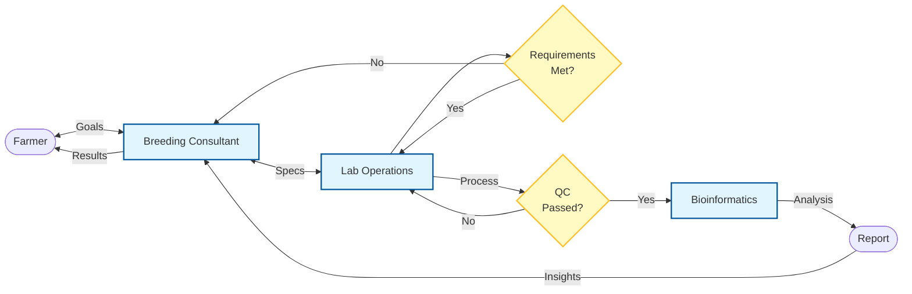
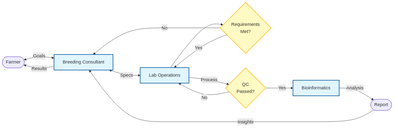
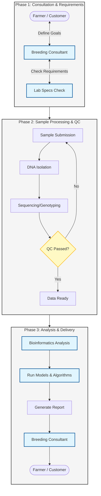
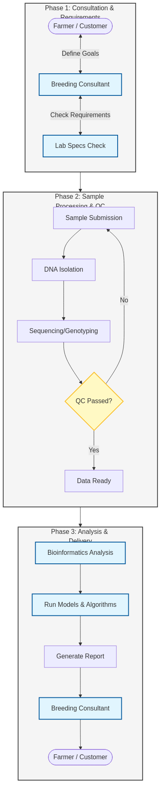

# NLFDP Service Catalog: Livestock, Aquaculture & Pathogen Genomics

## 1. Introduction
This catalog details the genomic and data science services offered by the National Livestock and Fisheries Development Program (NLFDP). Our mission is to advance food security and biosecurity in the Kingdom of Saudi Arabia through cutting-edge genomics.

**Scope**: This catalog focuses exclusively on:
- **Livestock**: Camels, Sheep, Bovine (Cattle), Chicken, Horse, Goats.
- **Aquaculture**: Nile Tilapia, Whiteleg Shrimp, Asian Seabass, Gilthead Seabream, Sobaity Seabream.
- **Pathogens**: Viral, bacterial, and parasitic threats to these species.

---

## 2. Role-Based Guides

### 2.1 For External Customers (Farmers, Breeders, Aquaculture Companies)
**Focus**: Productivity, Health Certification, Genetic Gain.
- **Why Genomics?**:
    - **Breeding**: Select the best animals/broodstock early, without waiting for them to mature.
    - **Health**: Detect diseases before outbreaks occur and certify your stock as pathogen-free.
- **How to Engage**:
    .  **Consultation**: Define your breeding or health goals.
    2.  **Sampling**: We provide kits for easy sample collection (hair, swabs, fin clips).
    3.  **Results**: Receive actionable reports (e.g., "Keep/Cull" lists, "Disease-Free" certificates).

### 2.2 For Internal Team

####  Business Development
- **Goal**: Drive adoption of genomic tools in the local industry.
- **Value Proposition**:
    - "Accelerate genetic progress by 2x."
    - "Reduce disease losses by 30%."
    - "Premium pricing for certified stock."
- **Key Questions**:
    - "Are you keeping pedigree records?"
    - "What is your main disease challenge?"
    - "Do you want to improve growth rate or survival?"

#### Technical Specialists
- **Goal**: Ensure successful project execution.
- **Checklist**:
    - **Species/Breed**: Is there a reference genome? (Check NCBI/Ensembl).
    - **Sample Type**: Tissue, Blood, Hair, Swab, Water?
    - **DNA Quality**: High MW required for long-read (PacBio/Nanopore).
    - **Metadata**: Is the farm recording phenotypes (weight, disease status)?

---

## 3. Process Workflow
The following flowchart illustrates the standard end-to-end process for our services, ensuring quality and actionable results.

*Figure 1: Service Delivery Workflow. Source file: [service_workflow.mmd](./service_workflow.mmd)*

### Alternative View: Phased Process

*Figure 2: Phased Service Delivery Process. Source file: [service_workflow_phases.mmd](./service_workflow_phases.mmd)*

---

## 4. Service Catalog

### 4.1 Livestock Genomics
*Accelerating genetic improvement in Camels, Sheep, Cattle, Chicken, Horses, and Goats.*

#### Genomic Selection (Genotyping & GEBV)
> **Select the best breeding animals with high accuracy using DNA markers.**

**Target Species**: Camels, Sheep, Bovine, Chicken, Goats.
**External View:**
- **Description**: High-density genotyping (SNP arrays or GBS) combined with pedigree and phenotype data to calculate Genomic Estimated Breeding Values (GEBVs).
- **Outcome**:
    - **Selection Intensity**: Identify elite sires/dams early in life.
    - **Trait Improvement**: Faster gain in milk yield, growth rate, and meat quality.
- **Turnaround**: 4-6 weeks (seasonal batches).

**Internal View:**
- **Workflow**: breeding consultant (Define Breeding Goal) -> Specialist (Design Genotyping Strategy) -> Lab (DNA Extraction & Array/Seq) -> Bioinfo (Imputation & GEBV Calculation).
- **Requirements**:
    - **Phenotypes**: Reliable records are mandatory for training populations.
    - **Pedigree**: Accurate family trees enhance accuracy.
    - **Reference**: Breed-specific reference populations may need to be established first.

#### Parentage Verification
> **Confirm lineage and resolve pedigree errors.**

**Target Species**: All Livestock (esp. Camels, Horses).
**External View:**
- **Description**: DNA-based verification of sire and dam to ensure pedigree integrity.
- **Outcome**: Certified pedigree records, essential for stud books and breed societies.
- **Turnaround**: 2-3 weeks.

**Internal View:**
- **Workflow**: breeding consultant -> Lab -> Bioinfo (Microsatellite or SNP matching).
- **Requirements**: Samples from offspring and potential parents.

#### Breed Characterization & Conservation
> **Analyze genetic diversity and distinctness of local breeds.**

**Target Species**: Native breeds of Camels, Sheep, Goats.
**External View:**
- **Description**: Whole genome analysis to map genetic diversity, inbreeding levels, and unique adaptive traits (e.g., heat tolerance).
- **Outcome**: Strategies for conservation and sustainable utilization of native genetic resources.
- **Turnaround**: 8-10 weeks.

**Internal View:**
- **Workflow**: Specialist (Sampling Design) -> Lab (WGS) -> Bioinfo (Admixture, ROH, PCA).
- **Requirements**: Representative sampling across the breed's geographic range.

---
*(Sections to be populated)*
### 4.2 Aquaculture Genomics
*Optimizing production and health for Tilapia, Shrimp, Seabass, and Seabream.*

#### Broodstock Management & Family Selection
> **Prevent inbreeding and select for faster growth.**

**Target Species**: Tilapia, Shrimp, Seabass, Seabream.
**External View:**
- **Description**: Genetic management of broodstock populations to maintain diversity and improve traits.
- **Outcome**:
    - **Inbreeding Control**: Avoid mating close relatives to prevent inbreeding depression.
    - **Growth Enhancement**: Select families with superior growth rates.
- **Turnaround**: 3-5 weeks.

**Internal View:**
- **Workflow**: breeding consultant -> Specialist -> Lab (Microsatellites/SNPs) -> Bioinfo (Pedigree reconstruction).
- **Requirements**: Fin clips (fish) or pleopods (shrimp) in ethanol.

#### Pathogen Screening (PCR & Sequencing)
> **Early detection of critical viral and bacterial pathogens.**

**Target Species**: Shrimp (WSSV, IHHNV, EHP), Fish (VNN, Streptococcus).
**External View:**
- **Description**: High-sensitivity molecular screening for specific pathogens.
- **Outcome**:
    - **SPF Certification**: Certified Specific Pathogen Free status for hatcheries.
    - **Early Warning**: Detect low-level infections before mass mortality events.
- **Turnaround**: 3-5 days (Rapid).

**Internal View:**
- **Workflow**: breeding consultant -> Lab (qPCR/Targeted Seq) -> Bioinfo (QC).
- **Requirements**: Fresh or preserved tissue; strict chain of custody for certification.

#### Water Quality Metagenomics
> **Monitor the microbial environment of your ponds/tanks.**

**Target Species**: All Aquaculture systems.
**External View:**
- **Description**: Analysis of microbial communities in water and sediment samples.
- **Outcome**:
    - **Biofilter Health**: Assess the performance of nitrifying bacteria in RAS.
    - **Pathogen Load**: Quantify the burden of potential pathogens in the environment.
- **Turnaround**: 3-4 weeks.

**Internal View:**
- **Workflow**: Specialist (Sampling Kit) -> Lab (16S/Metagenomics) -> Bioinfo (Taxonomic profiling).
- **Requirements**: Filtered water samples or sediment cores.
